# SCSS

- CSS 문법은 원시적이고 low 하다고 할 수 있다. 하지만 바로바로 적용되는 모습을 확인할 수 있어 재밌고 간단한 문법을 작성할 때에는 편리하다. 하지만 문서가 계속해서 고도화 된다면? 혹은 작은 예제와는 다르게 상위 선택자를 계속해서 선택하며 CSS 작업을 해줘야 한다면? 불편함은 더욱 커지게 된다.
- 이러한 불편함을 해소시켜주기 위해 등장한것이 SCSS 이다. 하지만 웹에서는 표준 CSS 만 동작이 가능하다. 그렇기 때문에 SCSS 자체로 CSS 를 대체하는것이 아니라 이를 전처리기로 통해 작성해 Compile 해주면 원하는 CSS 를 얻을 수 있는것이다.
- 즉 SCSS 는 전처리기를 통해 일반적으로 CSS 를 작성할때보다 편리해지지만 Compile 을 통해 원하는 CSS 결과를 도출해낼 수 있는 도구이다.

## 주석

- /_ ... _/ 처럼 CSS 의 주석또한 사용 가능하지만, 자바 스크립트 처럼 // 을 사용한 주석도 사용이 가능하다.
- CSS 와 같은 주석을 컴파일 되는 주석이라고 얘기한다. 컴파일 시키기 싫어서 주석을 다는데 컴파일이 되는 주석은 대체 무엇을 의미하는 것 일까?
- 여기서 얘기하는 컴파일은 다른 프로그래밍 언어와 같은 컴파일처럼 생각하면 안 된다. 주석이 컴파일 된다고 해서 원하지 않는 코드가 작동하는 것이 아니라, CSS로 주석이 넘어가는것이다. 즉, 내가 코드에 대해 설명을 해놓는다면 그 주석이 그대로 CSS 로 넘어가게 되는 것이다.

## 데이터 종류

> 다른 데이터 타입들은 그렇다 치더라도 Lists 나 Maps 의 경우 정말 신기했다. SCSS, 즉 CSS 를 다루는 전처리기에서 프로그래밍 언어와 같은 데이터 타입이 존재한다.

- Numbers : 말 그대로 숫자들이 포함된 값이다. px, em 같은 단위들이 여기에 속한다.
- Strings : bold 나 relative 같은 문자열로 적용되는 속성들을 의미한다.
- Colors : 색상표현시에 사용되는 데이터 종류들을 의미한다.
- Booleans : True, False 값.
- Nulls : 아무것도 없음!
- Lists : 공백이나 ,로 구분된 값의 목록들이다.
- Maps : Python 의 dictionary 와 같은 Key: Value 쌍의 데이터 타입이다.

## 특이사항

- Numbers: 숫자에 단위가 있을 수도 있지만 없을 수도 있다.
- Strings: 문자에 따움표가 있다. 다른 언어들과는 다르게 따움표가 없어도 문자로 인식한다.
- Nulls: 만약 속성값으로 null 이 사용되면 컴파일 하지 않는다.
- Lists: () 를 붙여도 되고, 붙이지 않아도 된다.
- Maps: 위와는 다르게 map 은 꼭 () 를 붙여서 사용해야 한다.

## 중첩

- SCSS 에서는 괄호를 사용해 상위 선택자 선택의 반복을 피할 수 있다. 수업 시간에 사용되는 예제들에서는 크게 불편함을 느낄 정도로 반복되진 않았지만 만약 프로젝트 크기가 크진다면 꽤나 번거로울 것 같다. SCSS 의 중첩 기능은 직관적이고 간결하다. 원하는 상위 선택자의 내부에 선언해주면 VSCode 의 emmet 기능 처럼 감싸주고 내부에 CSS 선언이 가능하다.

```Scss
.section {
  width: 100%;
  .list {
    padding: 20px;
    li {
      float: left;
    }
  }
}
```

- 누가 봐도 .section 의 .list 에 속성을 주고, li 에 float:left 를 주는 것처럼 느껴진다. (사실 그 정도는 아닐수도 있다ㅎ) 아래와 같이 컴파일 된다!

```CSS
.section {
  width: 100%;
}
.section .list {
  padding: 20px;
}
.section .list li {
  float: left;
}
```

## Ampersand (상위 선택자 참조)

- & 를 사용하면 상위 선택자로 치환된다. 글을 처음 읽었을 때는 사실 내부에서 알아서 중첩과 같이 처리해줄텐데 어떤 색다른 장점이 있었나 싶었다. 그리고 아래 코드를 보고 모르면 내가 이해를 못 했기 때문이라는것을 느꼈다.

```SCSS
.fs {
  &-small { font-size: 12px; }
  &-medium { font-size: 14px; }
  &-large { font-size: 16px; }
}
```

- 중첩과는 다르게 중복되는 부분에 원하는 값을 더해서 선언하는 것 또한 가능하다. & 에 상위 선택자의 이름이 들어온다고 생각하면 된다. 역시 여러번 기입할 필요 없이 아래와 같이 컴파일 된다.

```CSS
.fs-small {
  font-size: 12px;
}
.fs-medium {
  font-size: 14px;
}
.fs-large {
  font-size: 16px;
}
```

## @at-root (중첩 벗어나기)

- **중첩을 벗어나고 싶으면 중첩안에 기입하지 않으면 될텐데** 라는 생각이 먼저 들었던 부분이었다. 특히 **중첩 안에서 생성하되, 중첩 밖에서 사용** 이라는 부분이 이해가 안 됬다. 하지만 다른 선택자들과 같은 width 를 공유하거나 height 등을 공유하게 된다면 중첩에서 사용된 변수를 통해 선언해주는 것이 좀 더 편리할 것이다.

```SCSS
.list {
  $w: 100px;
  $h: 50px;
  li {
    width: $w;
    height: $h;
  }
  @at-root .box {
    width: $w;
    height: $h;
  }
}
```

- 위 예제와 같이 width, height 값을 변수로 지정해 다른 선택자에 사용하지만, 상위 선택자의 중첩을 벗어나고 싶다면 @at-root 를 사용하면 된다. 아래와 같이 컴파일 된다.

```CSS
.list li {
  width: 100px;
  height: 50px;
}
.box {
  width: 100px;
  height: 50px;
}
```

## 중첩된 속성

- 중첩은 상위 선택자의 반복을 피하기 위해서만 사용하지 않는다. CSS 의 대표적인 값을 선언하고, 동일한 네임 스페이스를 가지는 속성들을 내부에 선언해주면 속성명의 반복 또한 피할 수 있다.

```SCSS
.box {
  font: {
    weight: bold;
    size: 10px;
    family: sans-serif;
  };
  margin: {
    top: 10px;
    left: 20px;
  };
  padding: {
    bottom: 40px;
    right: 30px;
  };
}
```

- 아래와 같이 같은 네임스페이스를 가지는 속성들이 기입한 속성 값으로 컴파일 된다.

```CSS
.box {
  font-weight: bold;
  font-size: 10px;
  font-family: sans-serif;
  margin-top: 10px;
  margin-left: 20px;
  padding-bottom: 40px;
  padding-right: 30px;
}
```

## 변수

- 프로그래밍의 변수와 똑같다. 한 가지 다른점이 있다면 변수의 선언은 $ 를 통해서 지정된다. 즉, 변수의 이름 앞에는 꼭 $를 붙여야 한다.

```SCSS
$w: 200px;
$h: 300px;
$url-image: "./img/image.png";
```
## 변수 - 유효범위, 재할당
- SCSS에서 변수는 선언된 블록 {} 내에서만 유효범위를 가진다. 
- 유효범위 예시
    - 아래의 경우 .box 내서 선언한 변수 color가 .box2에서 다시 한번 등장한다. 이 경우 변수 color가 선언된 위치가 .box2외부이기 때문에 오류가 발생한다.  
    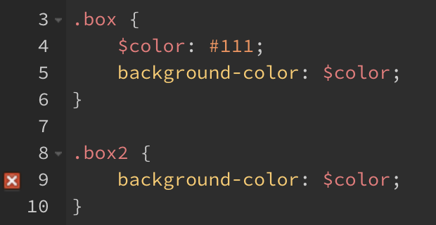

    - 다음과 같이 사용하는 것이 올바른 사용 예시이다.  
    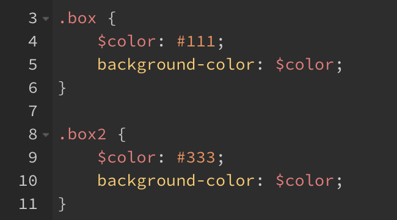

- 또한, 변수는 재할당이 가능하다.
    - 아래의 경우 변수 black이 먼저 선언되어있고, color-primary에 black을 재할당하고 있다. 올바른 문법으로 정상 동작한다.  
    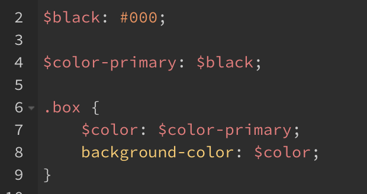


## 변수 - 전역설정
- 다른 언어와 마찬가지로 SASS에서도 전역변수가 존재한다.
- `!global` 키워드를 사용하여 변수의 유효범위를 전역(Global)으로 설정한다.
- [변수의 유효범위](#변수의-유효범위)에서 나온 첫번째 예제에서 유효범위에 의한 문법 오류를 확인했었다. 이곳에 !global 키워드를 넣게 되면 어떻게 될까?
    - 코드  
    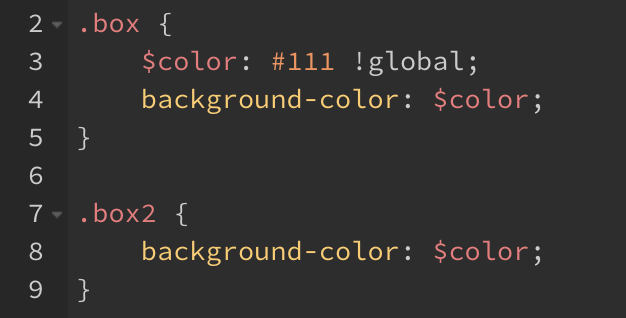

    - 결과: 정상 작동함을 확인할 수 있다.  
    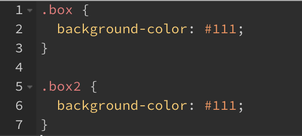

- 이때, 주의해야할 점이 존재한다. 다음 두가지 예시를 보자.
    - 첫번째 예시
        - 다음 예시는 1번째 줄에서 color가 전역으로 선언되고 9번째 줄에서 다시 한번 전역으로 선언되는 코드이다.  
        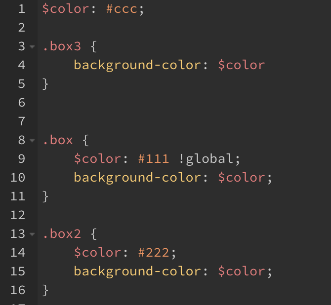

        - 결과는 다음과 같다. 위에 존재하는 가장 가까운 위치의 전역 변수로 사용되게 된다. 다른 예시도 확인해보자.  
        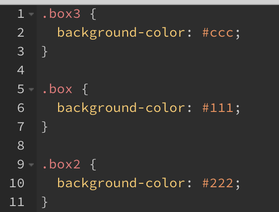

    - 두번째 예시
        - 첫번째 예시의 4번째 줄과 5번째 줄 순서를 바꾸면 어떻게 될까?
        - 다음과 같이 가장 위에 있는 전역변수를 찾아가므로 #111이 아닌 #ccc 값을 가진다.  
        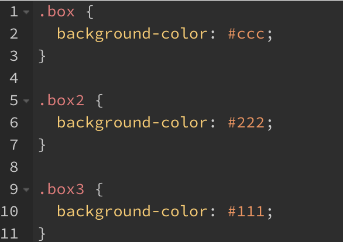

    - 세번째 예시
        - 이번에는 .box3을 가장 아래로 보내보았다.  
        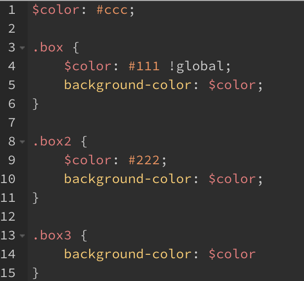
        
        - 결과는 다음곽 같다. box3의 위에 존재하는 가장 가까운 전역 변수는 4번째 줄에 선언되어 있는 전역 변수이기 때문에 #111이 나오게 된다.  
        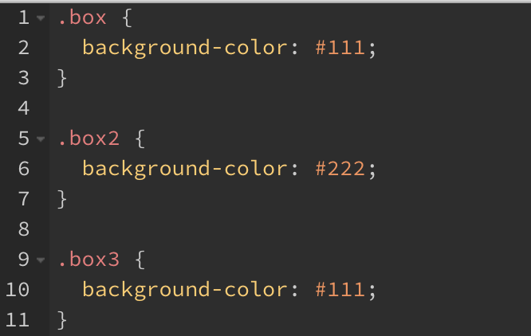

    
## 초기값 설정, 문자 보간
- !default
    - !default 플래그는 할당되지 않은 변수의 초기값을 설정한다.
    - 만약 기존 변수가 존재할 경우 현재 설정하는 사용하지 않고 기존 값을 사용할 수 있다. 그렇기 때문에 외부 라이브러리를 사용하더라도 내가 작성한 변수가 기존 코드를 덮어쓰기할 위험성이 적어진다.
    - 아래에서 4번째 줄의 변수 color가 blue가 아닌 red가 할당됨을 확인할 수 있다.  
    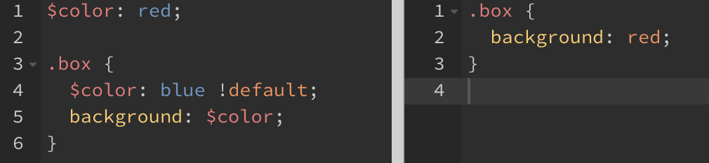

- #{}(문자보간)
    - 특정 변수를 #{}를 사용해 코드 어디서든 사용할 수 있다.
    - 다음과 같이 색상도 조합 가능하다.  
    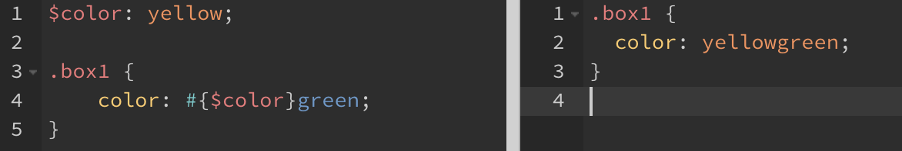

## 가져오기(Import)
- 기존 css와 마찬가지로 `@import`를 사용하여 다른 Sass파일을 연결시킬 수 있다. 하지만 문법과 작동 방식이 다르다.
- scss규칙으로 동작하는 경우
    - 확장자가 .scss인 경우
        - @import "test.scss"
- css규칙으로 동작하는 경우
    - 확장자가 .css인 경우
        - @import "test.css"
    - 파일 이름이 `http://`로 시작하는 경우
        - @import "http://test.com"
    - url()이 붙은 경우
        - @import url(test)
    - 미디어쿼리가 있는 경우
        - @import "test" screen

## 여러 파일 가져오기
- 하나의 @import로 여러 파일을 가져오는 것이 가능하다.
```css
@import "test1", "test2";
```

## 파일 분할(Partials)
- 프로젝트 규모가 커지면 유지보수 관점에서 개발하는 것이 필요하다. 하나의 파일 내에 모든 css를 담고 있다면 유지보수 관점에서 좋지 않을 수 있다. 그러한 이유로 파일을 분할하게 되는데 분할된 모든 파일이 컴파일 시 각각의 css로 저장되게 되면 관리차원에서 문제가 있을 수 있다.
- 해당 문제를 해결하기 위해 각 기능별로 파일을 나누어 작성을 하고 파일 이름 앞에 `_`를 붙여 작성을 하고 `main.scss`에서 `_`가 작성되어 있는 파일들을 import한다.
- 그 후, main.scss를 컴파일하게 되면 main.css 하나가 결과물로 나오게 된다.

## 연산
- Sass는 기본적인 연산 기능을 지원하며 연산을 통해 원하는 값을 간단하게 지정할 수 있다.
- 산술 연산자
    - `+`, `-`, `*`, `/`, `%`
    - `*`(곱하기)의 경우 하나 이상의 값이 반드시 숫자여야 한다.
    - `/`(나누기)의 경우 오른쪽 값이 반드시 숫자여야 한다.

- 비교 연산자
    - `==`, `!=`, `<`, `>`, `<=`, `>=`

- 논리 연산자
    - `and`, `or`, `not`

## 연산 - 숫자
- 숫자의 연산을 할 때는 `calc()` 연산을 사용한다. 주로 상대적 단위인 `%`, `em`, `vw` 등의 값을 얻을 때 사용한다.
- 사용 예시
    ```css
    width: calc(30% - 15px);
    ```

- 다른 연산자와 다르게 나누기 연산자를 사용할 경우 주의를 해야한다. 하나의 예로, `margin: 30px / 2;`를 수행했다고 했을 때 올바른 결과가 나오지 않는다. 그 이유는 CSS는 `grid-area: 2 / 1 / 2 / 4;`와 같이 속성값의 숫자를 분리하는 방법으로 `/`를 허용하기 때문에 `/`가 나누기 연산으로 사용되지 않을 수 있다.
- 따라서, `/`를 나누기 연산으로 사용하기 위해서는 다음과 같은 조건들을 만족해야 한다.
    - 값이 변수에 저장되거나 함수에 의해 반환되는 경우
    - 값이 `()`로 묶여있는 경우
    - 값이 다른 산술 표현식의 일부로 사용되는 경우  
    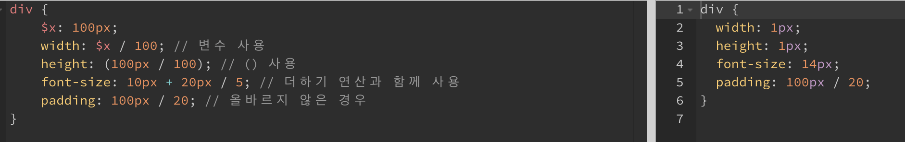

## 연산 - 문자
- 문자 연산의 경우 `+`를 사용한다.
- 문자 연산의 경우 피연산자의 상태에 따라 다른 결과값이 나오게 된다.
- 피연산자에 따옴표가 존재한다면 연산 결과는 따옴표로 묶이게 되고, 존재하지 않는다면 연산 결과 역시 존재하지 않는다.  
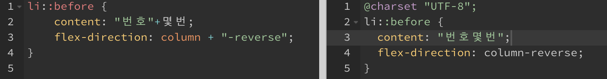

## 연산 - 논리
- Sass의 @if 조건문에 사용되는 논리 연산에는 `and`, `or`, `not`이 존재합니다.
- 아래 예시에서 not과 and 연산에 따라 동작하는 것을 확인할 수 있다.  
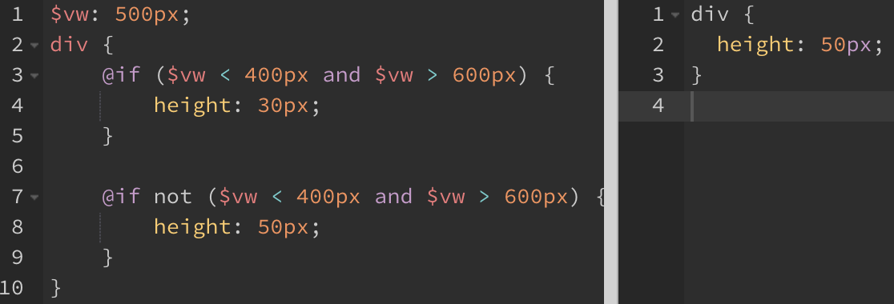


## 재활용 - Mixin, Include 1
- Sass의 Mixin은 재사용 할 CSS 선언 그룹을 정의하는 기능이다. `@mixin`을 통해 선언하고 `@include`를 통해 사용할 수 있다.
- 함수와 비슷한 모양을 가지고 있으며, 입력 인자가 없을 경우 기본값을 설정하여 사용할 수 있다.
- 다음 예시에서는 기본 값을 설정하되, 각 인자 값에 다른 입력값을 넣어 다른 결과가 나오게 하였다.  


## 조건문 - if
- SCSS는 조건문을 지원합니다.
- 두가지 방식의 if 방식이 있습니다.
- 논리연산자를 이용해서 다양한 조건문을 만들 수 있습니다.

## if(조건, 표현식1, 표현식2)
- 삼항연산자(조건 ? 표현식1 : 표현식2)와 유사한 방식으로 동작하게 됩니다. 
- 조건이 true일 경우 앞의 표현식, false일 경우 뒤의 표현식이 선택됩니다.
```SCSSS
div{
    $width: 555px;
    width: if($width>300px, 100px, 500px);  // $width변수가 300px보다 클 경우 100px로, 300px이하일 경우 500px로 적용됩니다.
}
```
## @if, @else if, @else
- 삼항연산자 방식과 다르게 조건을 여러가지 달 수 있습니다.

```SCSS
@if($widtn <780px){
    //모바일
}@else if($width< 1280px){
    //태블릿
}@else{
    //데스크탑
}
```
## 반복문 - @for, @each, @while
- 스타일을 반복적으로 적용시킬 때 주로 사용합니다.

## @for
- @for는 through를 사용하는 형식과 to를 사용하는 형식으로 나뉩니다.
- "@for $변수 from 시작 (to or through) 종료" 순으로 입력합니다.

### through 방식
- through 뒤의 숫자까지 포함해서 반복하게 됩니다.
```SCSS
@for $index from 1 through 3{
    .through:nth-child(#{$index}){  // 1번부터 3번 자식까지 적용됩니다.
        width: 20px * $index;
    }   
}
```
### to 방식
- to 뒤의 숫자는 포함하지 않고 반복을 하게 됩니다.
```SCSS
@for $index from 1 to 3{   // 1번부터 2번 자식까지 적용됩니다.
    .through:nth-child(#{$index}){
        width: 20px * $index;
    }   
}
```

## @each
- List나 Map의 요소들을 순서대로 꺼내면서 반복문 안의 내용을 실행할 수 있습니다.
- 이미지가 많을 경우 배열에 담긴 이미지의 주소를 반복문으로 효율적으로 코드를 짤 수 있습니다.
```SCSS
$fruits: (apple, orange, banana, mango);
.fruits{
    @each $fruit in $fruits{
        &.#{$fruit}{
            background: url("/images/#{$fruit}.png");
        } 
    }
}
```
## @while
- 조건이 false가 될 때 까지 안의 내용을 반복합니다.
- 무한 루프에 빠지지 않도록 코드를 짜야합니다.
```SCSS
$count: 6;
@while $count >0{
    .item-#{$count}{
        width: 2px;
    }
    $count: $count-1;
}

```
## 내장 함수
- sass에서 기본적으로 제공하는 함수입니다.
- 함수를 모두 외우지 않고 함수의 쓰임새만 알고 있으면 필요할 때 사용법을 찾아서 쓰면됩니다.

## 자주 사용 될 수 있는 내장 함수
- 크게 color함수, number함수, string함수, list함수, map함수가 있습니다.

## color함수
- mix(color1, color2): 두개의 색을 혼합한 색을 반환합니다.
```SCSS
mix(#f00, #00f)      // #7f007f
mix(#f00, #00f, 25%) // #3f00bf
mix(rgba(255, 0, 0, 0.5), #00f) // rgba(63, 0, 191, 0.75)
```
## number함수
- round(number1): 소수점 이하 반올림
```SCSS
round(4.1px) // 4px
round(16.8px) // 17px
```
## string 함수 
- str-slice($string, $start-at, [$end-at]) : 문자에서 특정 문자(몇 번째 글자부터 몇 번째 글자까지)를 추출합니다.
```SCSS
string.slice("Helvetica Neue", 11); // "Neue"
string.slice("Helvetica Neue", 1, 3); // "Hel"
string.slice("Helvetica Neue", 1, -6); // "Helvetica"
```
## list함수
- index($list, $value): 두 번째 인자로 전달된 값이 리스트의 몇 번째 요소에 있는지 확인한다.
```SCSS
index(1px solid red, solid)                       // 2
index(1px solid red, dashed)                      // null
index((width: 10px, height: 20px), (height 20px)) // 2
```

## map함수
- map-values($map) : Map에서 모든 value를 List로 반환합니다.
```SCSS
$font-weights: ("regular": 400, "medium": 500, "bold": 700);
map.values($font-weights); // 400, 500, 700
```

